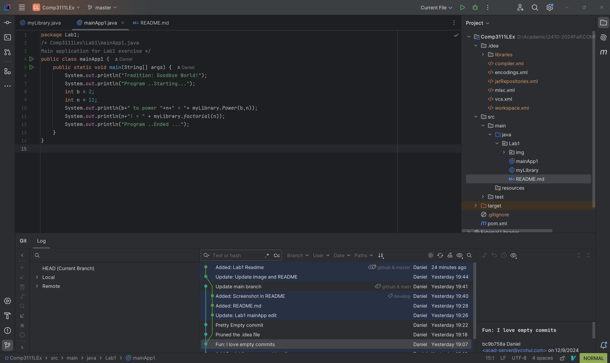

# COMP3111 
## Lab 1: Introduction to IntelliJ
> tbh I like to use VSCode more than IntelliJ, for the general purpose

# Screenshot as required

## Side Notes

 
    
Nothing inside

- Are you supposed to push the `.idea/` folder to the remote?
    - gotta prune it at `main`
- Why default branch is still `master` too?

  
